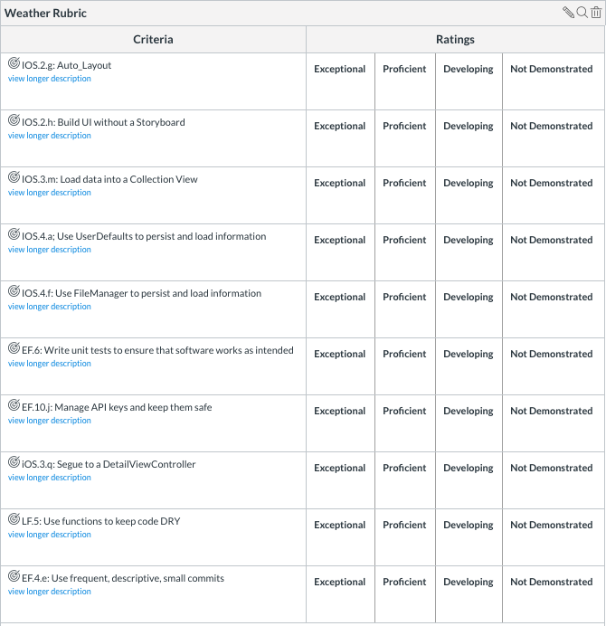

# Pursuit-Core-iOS-WeatherApp
Weather app allows the user to enter a zipcode then displays the 7-day forecast. 

# Weather App

# Overview

Your app should let the user input a zipcode, then see the 7-day forecast.  Selecting a forecast should display more information about the weather for that day, along with a random image of the city matching the zip code.  The user can favorite the image, then view a list of all of their favorited images.

# Gif

# Github
- create your own repo
- commit often to your repo
- submit your final repo link to canvas

# Detailed Overview

There should be 3 Main View Controllers

1. The main weather view controller
2. The weather detail view controller (with city pic)
3. The favorite images view controller

### Main weather view controller

The main weather view controller should have:

- A Label that names the city for the forecast
- A CollectionView to show the forecasts
- A TextField for the user to enter the zip code

Selecting a collection view cell should segue to a weather detail view controller

### Detail weather view controller

The weather detail view controller should have:

- A Label naming the city and the forecast date
- A random image of the city
- A Label with a longer description of the weather
- Additional information about the weather including the high, low, sunrise, sunset, windspeed and precipitation

Selecting the "Save" bar button item should save the image to your favorites and present an alert view informing the user.

### Favorite images view controller

The favorite images view controller should have:

- A table view that contains all of the images that have been favorited.

The image at the top should be the most recently favorited image.

# Persistence

1. Use UserDefaults to store the most recently searched zip code
2. Use FileManager to store the images to disk

# Programmatic UI

- You must make at least one of your View Controller without a Storyboard or xib file, building the UI and constraints fully programmatically.

# Endpoints

1. [Dark Sky API](https://darksky.net/dev)
2. [Pixabay API](https://pixabay.com/api/docs/) 

# Bonus Ideas

- Allow the user to search by the cityname or zipcode
- Allow the user to toggle whether the displays should be US or Metric.  Persist this to UserDefaults
- Add animations

# Rubric

